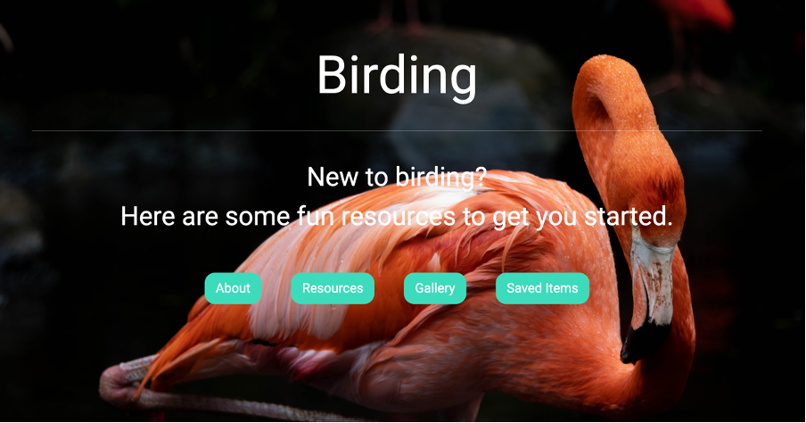
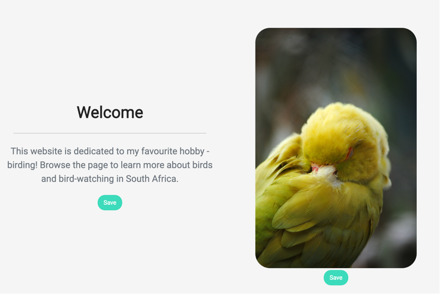
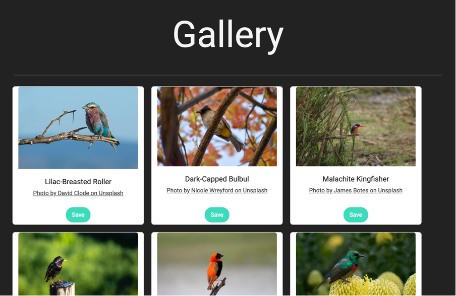
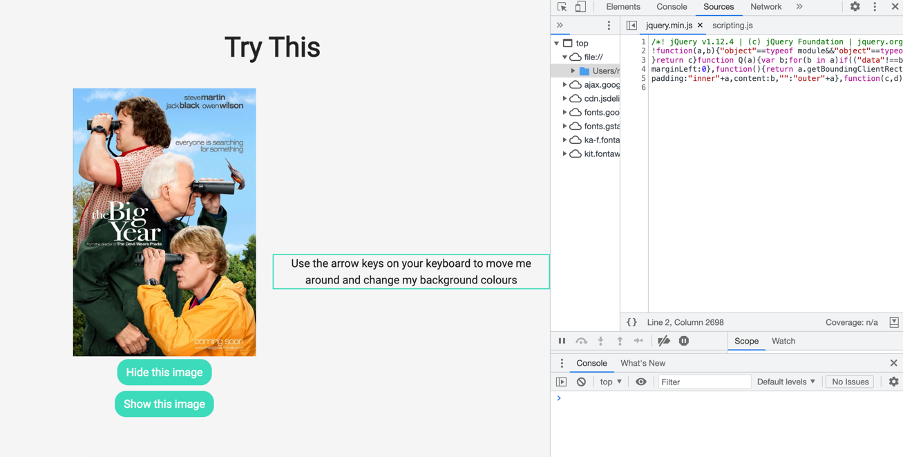
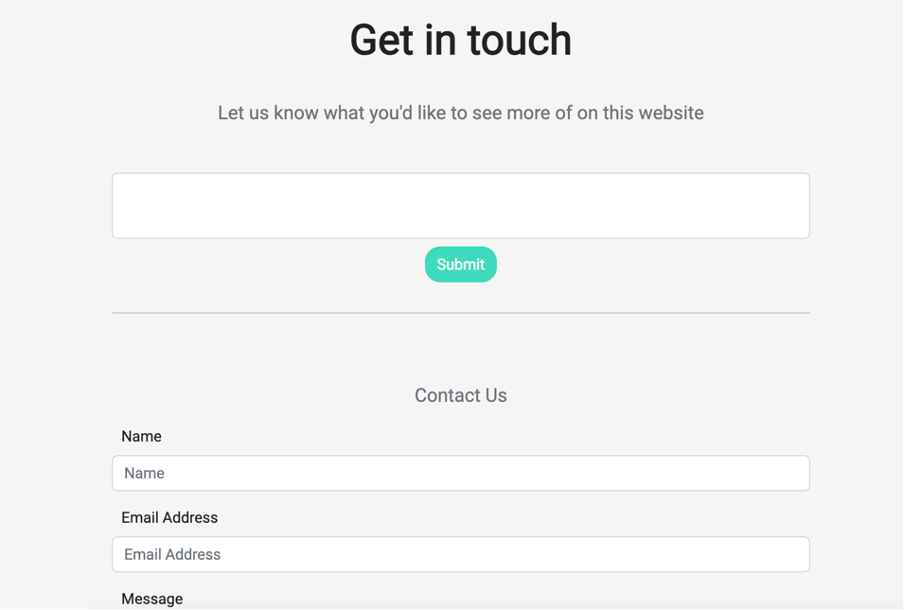

# Birding-Website-Deployment
This is my IFS L1T24 and L1T25 Project showcasing my HTML, CSS/SCSS, JavaScript and jQuery skills.

## Description
The project goals for each task were as follows:
* **IFS L1T24:** deploy a static website I made about Birding (from my L1T20 Capstone Project).
* **IFS L1T25:** add a README file to the repository, following L1T25 specifications.

The Birding website provides users with information on Birding as a hobby with links to various resources.
It includes some JavaScript functionality to save items on the site in a personal "Save for Later" page and animates or changes some objects on the "Save for Later" page.

## Installation
To install this website:
1. Copy and paste [this URL](https://nicholedobbin.github.io/Birding_Website_Deployment//index.html) into your browser. 
2. Right-click on the opened page and select ‘inspect’ to see the source code for the website.
3. Alternatively, select the desired files/folders in this repository above to see the source code for the website.

## Usage
This project will be used by my HyperionDev course collaborators and mentors to review and provide feedback on my progression. 
It is intended to provide users with information on Birding as a hobby and contains:

* **External links** to various resources 
* **“Save For Later”** functionality to allow users to save items to a personal file
* **Animation effects** to move and fade objects on the Save For Later page.

It is also intended to provide an example for other students to practice creating and deploying their own websites. 

***See images below for examples of this website's display, actions and functions***:

1. This is the "Birding" website homepage with navigation links.

2. This is the "Welcome" section with "Save for Later" and "Like" buttons.

3. This is the "Gallery" section with Bootstrap Cards, and "Save for Later" and "Like" buttons.

4. This is the "Try This" section of saveForLater.html with animations that add/remove an image and move/change colour of a paragraph.

5. This is the "Contact Us" section of saveForLater.html with forms and submit buttons.

## Credits
I created this project alone for the HyperionDev IFS course. As per L1T25 instructions, I have invited an expert code reviewer and the "careers@hyperiondev" email address as collaborators to this project and to all the repositories I've created. If/when these collaborators join the project, I will credit and link to the authors here.

The references I used in creating this task can be found [in the "References.txt" file](References.txt).

